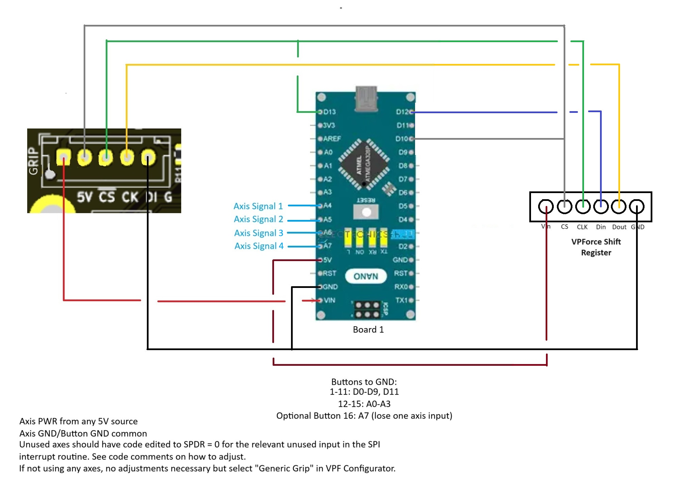

# Nano + Shift Register Configuration
CODE IN PROGRESS. SHIFT REGISTER MUST BE TYPE CD4021 or if using type SNx4HC165 you must invert the latch (CS) signal.
Uses one Arduino Nano with a 32 bit VPF Shift Register to achieve up to 48 buttons with 3 axes or 47 buttons with 4 axes. Can be used with or without axes. If axes are to be connected select "WinWing Adapter" in the VPF configurator. "Generic Grip" is untested on 48 button only with no axis configuration, you can try it but it is not guaranteed to work. Non VPF Shift Registers can be used provided they have the right type of configuration mentioned above. Code is only compatible with 32bit shift register boards, but can be modified to work with more or less registers.  

# DISCLAIMER
All code should be used at your own risk. I do not accept responsibilty for damages or loss due to implementation of this code. I am not a software engineer, so there are more than likely ways that this code can be improved. Please feel free to make suggestions for improvements but as long as things are working as intended I may reserve the right to keep things as is.

# NOTE
I have seen some 3rd party Nanos with ICSP headers that do not match the pinout of genuine Nanos. Verify connections with a multimeter before using these pins for programming or power. I have illustrated power/ground using only the edge pins for this reason. Using the ICSP pins may make wiring easier, but they must be verified prior to use. 

# Nano + Shift Register Wiring Diagram

