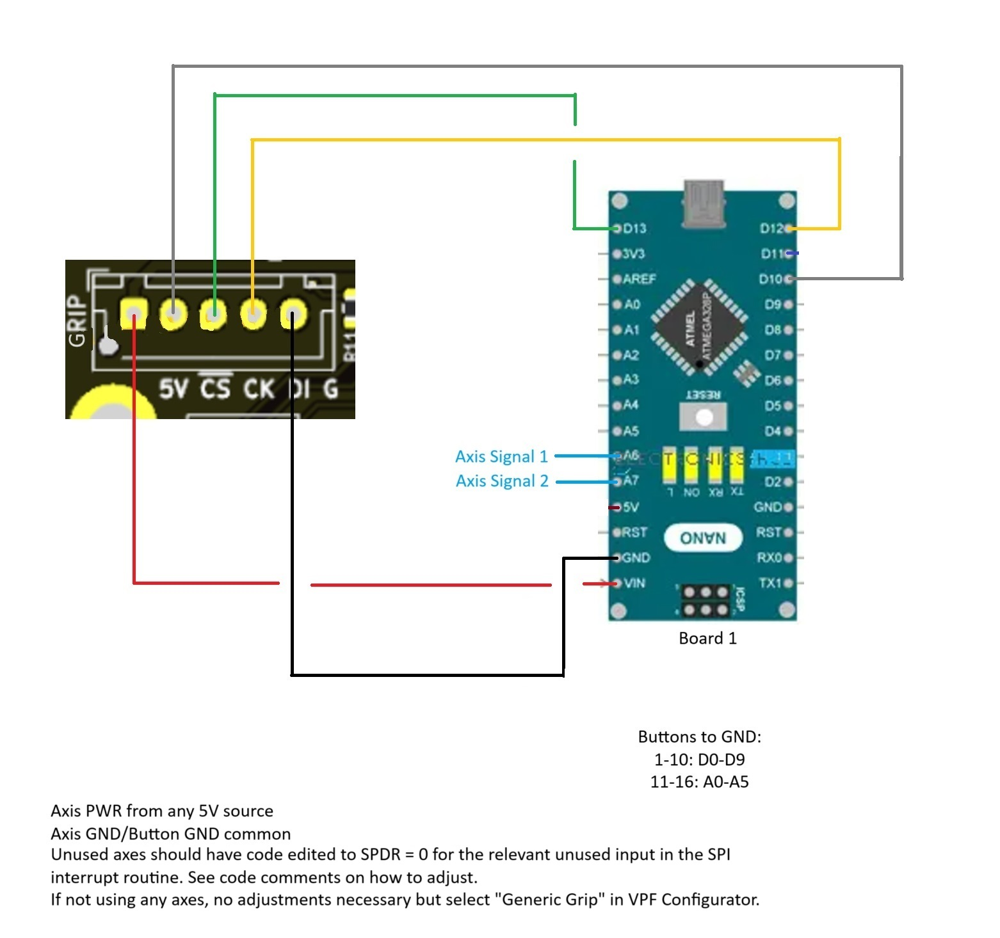

# Two Nano Configuration
Uses one Arduino Nano to achieve up to 16 buttons and 2 axes. Can be used with or without axes. If making a button only stick with this option, select "Generic Grip" in the VPF configurator. If axes are to be connected select "WinWing Adapter" in the VPF configurator. 

# DISCLAIMER
All code should be used at your own risk. I do not accept responsibilty for damages or loss due to implementation of this code. I am not a software engineer, so there are more than likely ways that this code can be improved. Please feel free to make suggestions for improvements but as long as things are working as intended I may reserve the right to keep things as is.

# NOTE
I have seen some 3rd party Nanos with ICSP headers that do not match the pinout of genuine Nanos. Verify connections with a multimeter before using these pins for programming or power. I have illustrated power/ground using only the edge pins for this reason. Using the ICSP pins may make wiring easier, but they must be verified prior to use. 

# Wiring Diagram

